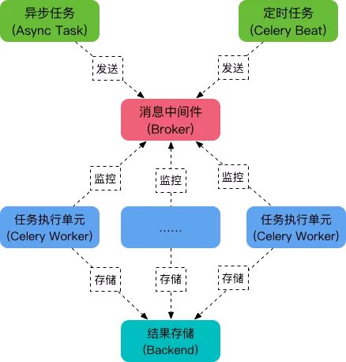

# what
- asynchronous task
- can erupt simultaneously run

# role
- Task
    异步任务 或 定时任务
- Broker
    消息代理, 队列本身. 也称为消息中间件. 接受任务生产者发送过来的任务消息, 存进队列再按序分发给任务消费方
    (通常是消息队列或者数据库)
- Worker
    任务执行单元，它实时监控消息队列，如果有任务就获取任务并执行它
- Beat
    定时任务调度器，根据配置定时将任务发送给Broler。
- Backend
    用于存储任务的执行结果。
  


# install
```
pip install celery==3.1.25 
pip install redis
celery --version
```

# start server
- celery -A celery_server worker -loglevel=info  # 前台启动不推荐
- celery -A celery_server worker -l info  # 前台启动简写
- celery multi start w1 -A  celery_server -l info  # 推荐用后台启动

# task scheduler
- delay
task.delay(args1, args2, kwargs=value_1, kwargs=value2)

- apply_async
delay 实际上是 apply_async 的别名, 还可以使用如下方法调用, 但是 apply_async 支持更多的参数:
task.apply_async(args=[arg1, arg2], kwargs={key:value, key:value})

- countdown
wait a little time to run
add.apply_async((2,3), countdown=5)

- eta
define task start time
add.apply_async((2,3), eta=now+tiedelta(second=10))

- expires
set expire time
add.apply_async((2,3), expires=60)

- retry
task fail, retry
add.apply_async((2,3), retry=False)

retry_policy:
- max_retries : 最大重试次数, 默认为 3 次.
- interval_start : 重试等待的时间间隔秒数, 默认为 0 , 表示直接重试不等待.
- interval_step : 每次重试让重试间隔增加的秒数, 可以是数字或浮点数, 默认为 0.2
- interval_max : 重试间隔最大的秒数, 即 通过 interval_step 增大到多少秒之后, 就不在增加了, 可以是数字或者浮点数, 默认为 0.2 .

# 指定队列
 修改配置文件, 保证队列优先级 
```angular2html
 from kombu import Queue 
 
 CELERY_QUEUE = (        # 定义任务队列.   
    Queue('default', routing_key="task.#"),     # 路由键 以 "task." 开头的消息都进入 default 队列.    
    Queue('web_tasks', routing_key="web.#")     # 路由键 以 "web." 开头的消息都进入 web_tasks 队列.) 
    CELERY_DEFAULT_EXCHANGE = 'tasks'           # 默认的交换机名字为 tasksCELERY_DEFAULT_EXCHANGE_KEY = 'topic'  
          # 默认的交换机类型为 
    topicCELERY_DEFAULT_ROUTING_KEY = 'task.default'     # 默认的路由键是 task.default , 
          这个路由键符合上面的 default 队列. 
 CELERY_ROUTES = {   
         'proj.tasks.add': {   
         'queue': 'web_tasks',  
                'routing_key': 'web.add',  
       }} # 使用指定队列的方式启动消费者进程.
        
  $ celery -A proj worker -Q web_tasks -l info    # 该 worker 只会执行 web_tasks 中任务, 我们可以合理安排消费者数量,让 web_tasks 中任务的优先级更高
```

# 阅后即焚模式(transient):
from kombu import QueueQueue('transient', routing_key='transient', delivery_mode=1)


### 